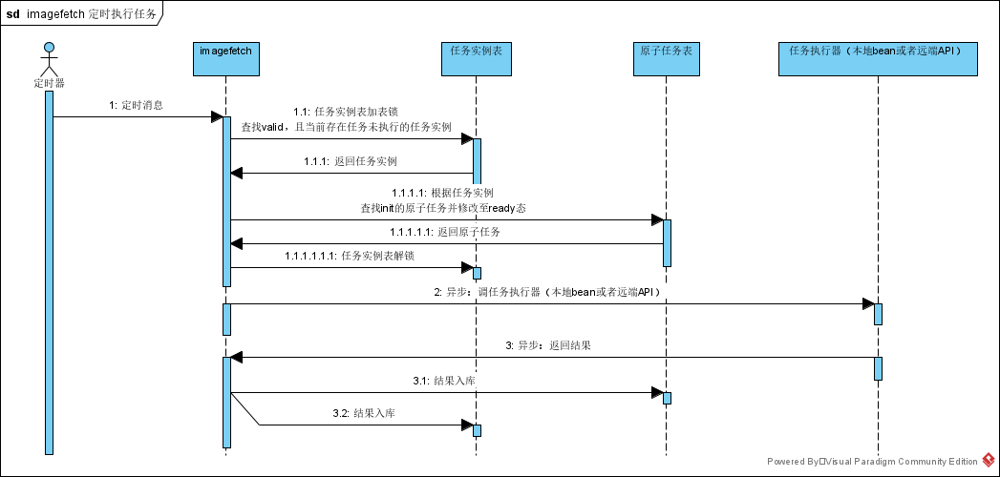

## imagefetch-图片获取模块，系统分析

### 1.版本

| 版本 | 描述     | 作者       | 日期     |
| ---- | -------- | ---------- | -------- |
| 0.1  | 基础功能 | jiaxiantao | 20200722 |
|      |          |            |          |

### 2 需求描述

- springboot框架

- 内部加单独定时器，定时从磁盘指定位置获取原始图片，调用topalg接口，获取处理完的图片，保存道磁盘

### 3 系统依赖

注：额外添加依赖：MySQL，相关任务机制。

### 4 模型分析

**service_config **服务配置表

| 字段         | 含义                                                         | 示例              |
| ------------ | ------------------------------------------------------------ | ----------------- |
| id           | 主键                                                         | 1                 |
| name         | 服务名                                                       | example_service   |
| sys_name     | 系统名                                                       | 示例系统          |
| bean_name    | bean名，与bean_type结合                                      | example_bean_name |
| bean_type    | bean类型，目前只支持“inner”，其他非法；0的含义是bean_name是JVM范围内的bean名，将动态调用这个bean。参数和返回值类型代码内指定。 | inner             |
| ext_info     | 额外信息可空                                                 |                   |
| gmt_create   | 创建时间                                                     |                   |
| gmt_modified | 修改时间                                                     |                   |

**task_config** 任务配置表

| 字段         | 含义                                       | 示例            |
| ------------ | ------------------------------------------ | --------------- |
| id           | 主键                                       | 1               |
| name         | 任务配置名                                 | example_config  |
| description  | 描述，可空                                 | 我是憨憨        |
| status       | 状态。仅valid（有效）和invalid（无效）两种 | valid           |
| ext_info     | 额外信息，可空                             |                 |
| service_name | 服务名，外键                               | example_service |
| gmt_create   | 创建时间                                   |                 |
| gmt_modified | 修改时间                                   |                 |

**task_instance** 任务实例表

| 字段         | 含义                                               | 示例             |
| ------------ | -------------------------------------------------- | ---------------- |
| id           | 主键                                               | 1                |
| name         | 任务实例名                                         | example_instance |
| description  | 描述，可空                                         | 我是憨憨实例     |
| config_name  | 任务配置名，外键                                   | example_config   |
| status       | 状态，ready初始化，run运行态，finish结束态，三选一 | ready            |
| priority     | 优先级，值越小优先级越高                           | 0                |
| total_num    | 总包含原子任务数                                   | 10               |
| finish_num   | 完成的原子任务数（不管成功失败）                   | 6                |
| fail_num     | 失败的原子任务数                                   | 2                |
| service_name | 服务名，外键                                       | example_service  |
| gmt_create   | 创建时间                                           |                  |
| gmt_modified | 修改时间                                           |                  |

**task_detail** 原子任务表

| 字段          | 含义                               | 示例             |
| ------------- | ---------------------------------- | ---------------- |
| id            | 主键                               | 1                |
| instance_name | 任务实例名，外键                   | example_instance |
| content       | 内容，和任务有关，将在详细设计描述 |                  |
| service_name  | 服务名，外键                       | example_service  |
| script        | 脚本，当前为空                     |                  |
| ext_info      | 额外信息，可空                     |                  |
| gmt_create    | 创建时间                           |                  |
| gmt_modified  | 修改时间                           |                  |
|               |                                    |                  |

### 5 详细设计

#### 5.1 定时执行任务逻辑：系统核心

因为涉及多表以及加锁逻辑，以下将对图中的1部分给出详细逻辑设计：任务的提取逻辑：

