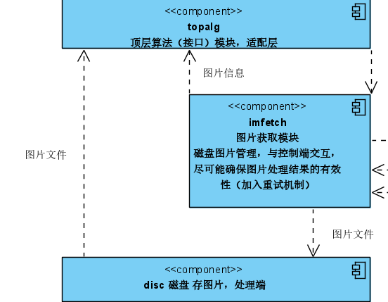
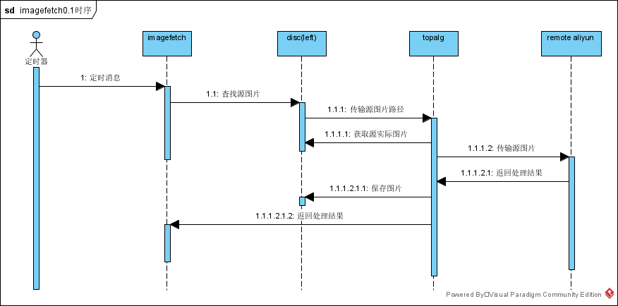

## imagefetch-图片获取模块，系统分析

### 1.版本

| 版本 | 描述     | 作者       | 日期     |
| ---- | -------- | ---------- | -------- |
| 0.1  | 基础功能 | jiaxiantao | 20200722 |
|      |          |            |          |

### 2 需求描述

- springboot框架

- 内部加单独定时器，定时从磁盘指定位置获取原始图片，调用topalg接口，获取处理完的图片，保存道磁盘

### 3 系统依赖

### 4 时序分析

