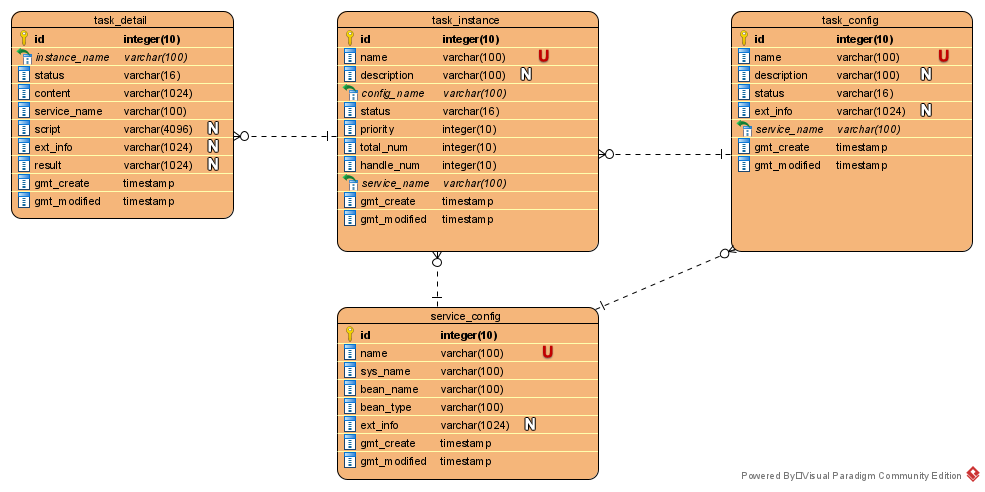

## imagefetch-backend 图片获取模块，系统分析

### 1.版本

| 版本  | 描述             | 作者       | 日期     |
| ----- | ---------------- | ---------- | -------- |
| 0.1   | 基础功能         | jiaxiantao | 20200722 |
| 1.0.0 | 打通链路，前后端 | jiaxiantao | 20200722 |

### 2 需求描述

- springboot框架

- 内部加单独定时器，定时从磁盘指定位置获取原始图片，调用topalg接口，获取处理完的图片，保存道磁盘

### 3.1 系统依赖

注：额外添加依赖：MySQL，相关任务机制。

### 3.2 模块划分

### 4 模型分析

**service_config **服务配置表

| 字段         | 含义           | 示例            |
| ------------ | -------------- | --------------- |
| id           | 主键           | 1               |
| name         | 服务名         | example_service |
| sys_name     | 系统名         | 示例系统        |
| bean_name    | bean名         | imageStyle      |
| bean_type    | bean类型，留空 | xxx             |
| ext_info     | 额外信息可空   |                 |
| gmt_create   | 创建时间       |                 |
| gmt_modified | 修改时间       |                 |

**task_config** 任务配置表

| 字段         | 含义           | 示例            |
| ------------ | -------------- | --------------- |
| id           | 主键           | 1               |
| name         | 任务配置名     | example_config  |
| description  | 描述，可空     | 我是憨憨        |
| status       | 状态。留空     | valid           |
| ext_info     | 额外信息，可空 |                 |
| service_name | 服务名，外键   | example_service |
| gmt_create   | 创建时间       |                 |
| gmt_modified | 修改时间       |                 |

**task_instance** 任务实例表

| 字段         | 含义                                               | 示例             |
| ------------ | -------------------------------------------------- | ---------------- |
| id           | 主键                                               | 1                |
| name         | 任务实例名                                         | example_instance |
| description  | 描述，可空                                         | 我是憨憨实例     |
| config_name  | 任务配置名，外键                                   | example_config   |
| status       | 状态，ready初始化，run运行态，finish结束态，三选一 | ready            |
| priority     | 优先级，值越小优先级越高                           | 0                |
| total_num    | 总包含原子任务数                                   | 10               |
| handle_num   | 已调度的原子任务数                                 | 6                |
| service_name | 服务名，外键                                       | example_service  |
| gmt_create   | 创建时间                                           |                  |
| gmt_modified | 修改时间                                           |                  |

**task_detail** 原子任务表

| 字段          | 含义                                 | 示例             |
| ------------- | ------------------------------------ | ---------------- |
| id            | 主键                                 | 1                |
| instance_name | 任务实例名，外键                     | example_instance |
| status        | 状态：init/ready/success/fail 四选一 | init             |
| content       | 内容，和任务有关，将在详细设计描述   |                  |
| service_name  | 服务名，外键                         | example_service  |
| script        | 脚本，当前为空                       |                  |
| ext_info      | 额外信息，可空                       |                  |
| result        | 结果（成功或失败后的结果），可空     | xxx              |
| gmt_create    | 创建时间                             |                  |
| gmt_modified  | 修改时间                             |                  |

### 5 详细设计

#### 5.1 定时执行任务

#### 5.2 前端接口

#### 5.2.1 服务配置

添加：

修改同理，除了POST的服务配置DTO含ID

查询POST空，接受`List<服务配置DTO>`

#### 5.2.2 任务配置

添加：

修改同理，除了POST的任务配置DTO含ID

查询POST空，接受`List<任务配置DTO>`

#### 5.2.3 上传图片压缩包并生成任务实例和原子任务

#### 5.2.4 查询任务(实例)

#### 5.2.5 查询所有图片

#### 5.2.5 激活任务(实例)