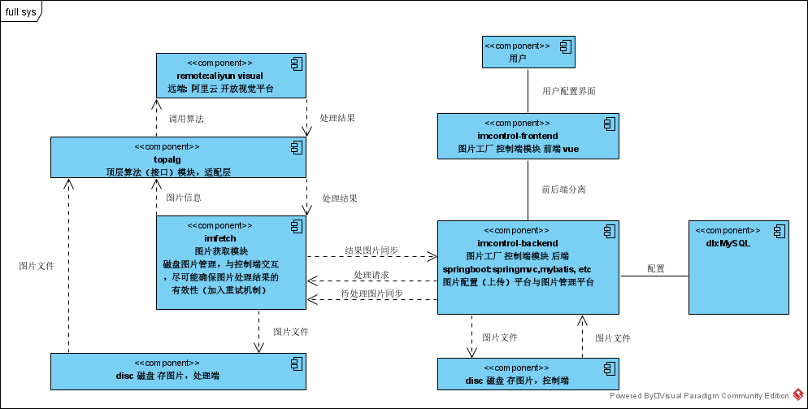

# 图片工厂——系统设计

## 1.版本

| 内容               | 时间       | 人                    | 版本   |
| ------------------ | ---------- | --------------------- | ------ |
| 初稿               | 2020.07.21 | jiaxiantao(blacksea3) | 0      |
| 通链路, 包括前后端 | 2020.08.07 | jiaxiantao(blacksea3) | v1.0.0 |

## 2.需求

用户在网页上批量提交图片处理请求和待处理图片，当图片处理完成后给予通知，下载处理结束的图片。

### 2.1 特点及主要功能

- 支持图片的处理功能：包括基本的：剪裁，压缩，黑白化；以及高级的：根据样本背景给图片设置背景风格。
- 支持图片任务组的设定，一个图片任务组包含多个图片，有相同的处理要求。
- 支持图片任务组中图片的批量处理
- 支持结果通知
- 支持多用户
- 对每个用户，支持对图片们的管理（上传下载、版本控制）

### 2.2 当前阶段1.0预期实现功能

2.1中图片的某个处理功能，如照图修图（根据样本背景给图片设置背景风格）

2.1中图片管理只包含上传下载，任务执行。

2.1中的其他都要实现。

## 3 模块及系统功能边界

#### 3.0系统拆分

阿里云的开放视觉平台、topalg、imfetch、左边的disc，属于一个系统（服务器/电脑）

imcontrol-frontend、imcontrol-backend、db:MySQL、右边的disc属于一个系统（服务器/电脑）

#### 3.1 外部依赖平台：阿里云的开放视觉平台

https://help.aliyun.com/document_detail/172093.html?spm=a2c4g.11186623.6.696.57bb3b70IyGiPI 

功能：照图修图功能，对外提供API。

#### 3.2 顶层算法：topalg

适配层，提供对外部依赖平台的传输数据（图片）预处理/API结果解析

标准java springboot工程，带有springmvc。

#### 3.3 图片获取模块：imfetch

左侧系统的核心模块，负责与topalg的交互。负责与右侧imcontrol-backend通信。负责与左侧磁盘disc的交互。

**图片定时批量拉取/执行任务的主要功能实现。**

标准java springboot工程，带有springmvc。

#### 3.4 图片控制模块-前端 imcontrol-frontend

与对应的后端成为标准前后端分离，对用户提供界面。

单独的前端模块，vue工程

#### 3.5 图片控制模块-后端 imcontrol-backend

与对应的前端成为标准前后端分离。

右侧系统的核心模块，负责与imcontrol-frontend的交互。负责与左侧imfetch通信。负责与右侧磁盘disc的交互。负责与数据库MySQL的交互

**管理平台的主要功能实现。**

标准java springboot工程，带有springmvc、带有数据库连接/ORM等、可能带有缓存（redis）视情况而定。

## 4 数据链路

典型的两种数据链路：

- 用户管理类/提交图片处理任务请求，由用户手动触发：用户->imcontrol-frontend->imcontrol-backend->DB/disc(右)->imcontrol-backend->imcontrol-frontend->用户

- 平台自动执行图片处理任务：imcontrol-backend的定时器->imcontrol-backend->DB/disc(右)->imcontrol-backend->imfetch->disc(左)->imfetch->topalg->remote_aliyun->topalg->imfetch->imcontrol-backend->db:MySQL->imcontrol-backend->微信通知用户

## 5 用户使用方法

- 在管理平台注册账号（或者用游客账号，自动生成的）
- 在管理平台提交图片任务组，提交图片，设置任务类别（当前只支持照图修图）
- 在管理平台提交任务执行。

接下来管理平台会定时触发执行任务，最终结果会入库，然后通知用户

- 用户收到通知，从管理平台上下载结果（通知里面附上一个链接用来下载结果，或者手动进入管理平台下载也可）

